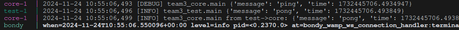

# Team3

## Technology Stack

- Docker & Docker Compose

### Backend Stack

- Python 3.12
- PDM (Python dependency manager)
- FastAPI (for API endpoints)
- MySQL

### Frontend Stack

- SvelteKit
- TypeScript
- TailwindCSS
- Vite (Build tool)
- Node.js

## Prerequisites

- Taskfile
- Docker & Docker Compose

### Backend Requirements

- Python 3.12 or higher
- PDM (Python dependency manager)
- MySQL Server

### Frontend Requirements

- Node.js (v18 or higher)
- npm (comes with Node.js)
- Modern web browser (Chrome, Firefox, Safari, or Edge)

## Backend

Backend service for the Aruba Cloud Services Budget Calculator, designed to help users with setup and budgeting of Aruba cloud services.

### Project Structure

```bash
aruba-budget-calc-be/
├── team3-lib/         # Shared library code
├── team3-core/        # Core business logic
├── team3-api/         # API service
└── team3-test/        # Test suite
```

### API Gateway

The API Gateway acts as a bridge between client applications and the CoreService, simplifying interactions and enabling efficient communication. It serves as the primary entry point for managing cloud resources and operations, handling user requests via a RESTful interface and relaying them to the CoreService for processing. The Gateway also handles CORS and integrates with the WAMP protocol for communication with the backend services.

Built using FastAPI, the API Gateway leverages asynchronous programming to handle high volumes of requests with minimal latency.

Available endpoints:
- `pricing`: Fetches pricing details for various resource types.
- `deploy`: Deploy resources to aruba cloud.

### Docker Build Stages

The project uses a multi-stage Dockerfile that includes:

- `runtime`: Base Python runtime environment
- `pdm`: PDM package manager setup
- `lib`: Team3 library package
- `core`: Core business logic
- `api`: API service
- `test`: Testing environment

Each stage is optimized for its specific purpose and includes only necessary dependencies.

### Environment Variables

The following environment variables are supported:

- `ENV`: Set to 'development' or 'production'
- `PYTHONPATH`: Automatically configured in Docker
- Additional environment variables can be configured via `.env` file

### Testing

Run tests using:

```bash
docker compose up api core test bondy
# or with Taskfile
task be:test
```

After a while, if everything works fine, you should see the ping message like the following:

> To be implemented:

```bash
docker compose run test pytest
```

## Frontend

### Developing

To start the project simply run

```bash
npm install
npm run dev
# or start the server and open the app in a new browser tab
npm run dev -- --open
```

### Building

To create a production version of your app:

```bash
npm run build
```

You can preview the production build with `npm run preview`.

## Contributing

1. Fork the repository
2. Create your feature branch (`git checkout -b feature/amazing-feature`)
3. Commit your changes (`git commit -m 'Add some amazing feature'`)
4. Push to the branch (`git push origin feature/amazing-feature`)
5. Open a Pull Request
