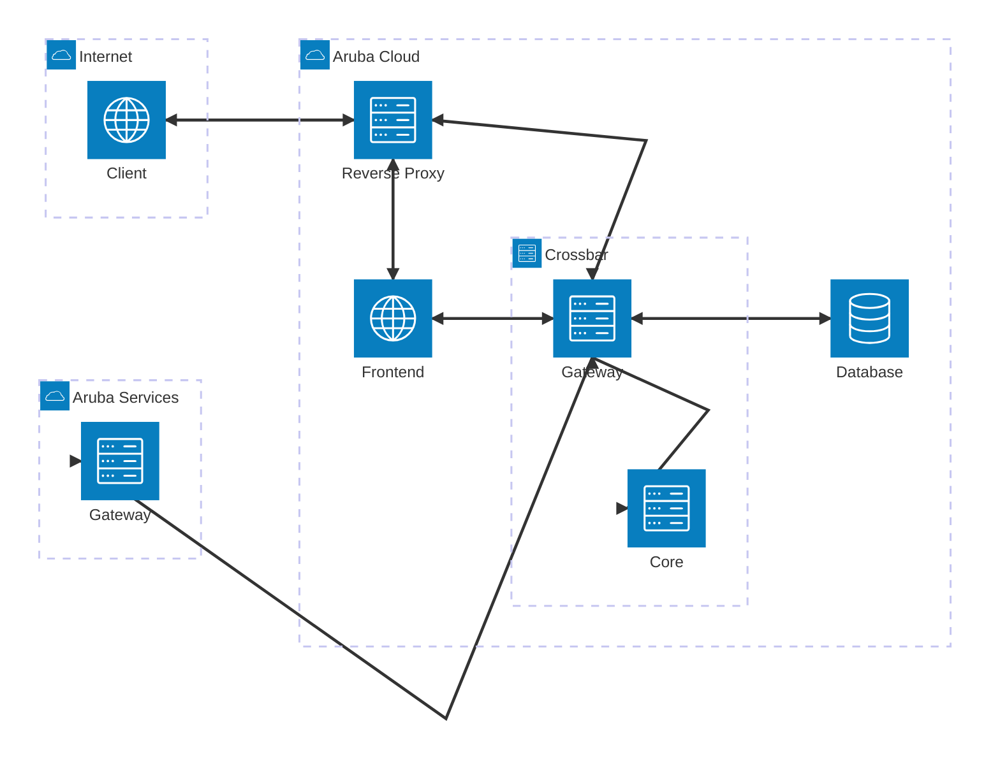

```mermaid
architecture-beta
    group aruba(cloud)[Aruba Cloud]
    group services(cloud)[Aruba Services]
    group bus(server)[Crossbar] in aruba
    group internet(cloud)[Internet]

        service gateway(server)[Gateway] in bus 
        service core(server)[Core] in bus
        service db(database)[Database] in aruba
        service frontend(internet)[Frontend] in aruba

        service client(internet)[Client] in internet

        service api(server)[Gateway] in services
        service nginx(server)[Reverse Proxy] in aruba

    client:R <--> L:nginx
    nginx:B <--> T:frontend
    frontend:R <--> L:gateway 
    nginx:R <--> T:gateway
    gateway:B <--> L:core
    gateway:B <--> L:api
    gateway:R <--> L:db

```
