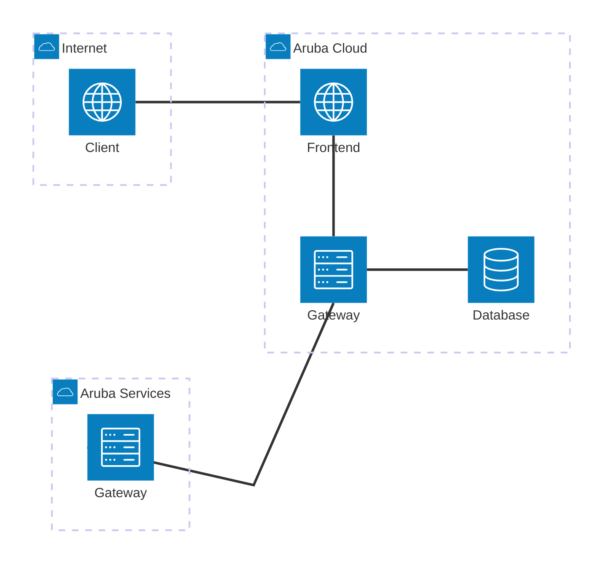

```mermaid
architecture-beta
    group aruba(cloud)[Aruba Cloud]
    group services(cloud)[Aruba Services]
    group internet(cloud)[Internet]

        service gateway(server)[Gateway] in aruba
        service db(database)[Database] in aruba
        service frontend(internet)[Frontend] in aruba

        service client(internet)[Client] in internet

        service api(server)[Gateway] in services

    client:R -- L:frontend
    frontend:B -- T:gateway
    gateway:B -- L:api
    gateway:R -- L:db

```