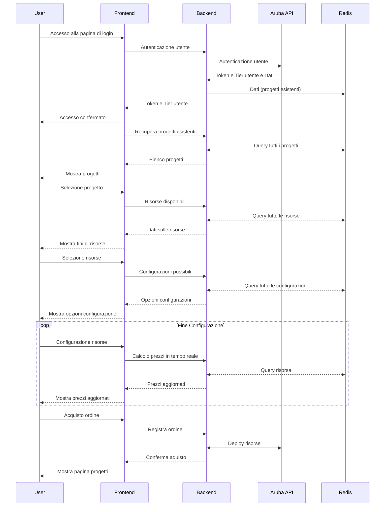

```mermaid
sequenceDiagram
    participant User
    participant Frontend
    participant Backend
    participant Aruba API
    participant Redis

    User->>Frontend: Accesso alla pagina di login
    Frontend->>Backend: Autenticazione utente
    Backend->>Aruba API: Autenticazione utente
    Aruba API-->>Backend: Token e Tier utente e Dati
    Backend->>Redis: Dati (progetti esistenti)
    Backend-->>Frontend: Token e Tier utente
    Frontend-->>User: Accesso confermato

    Frontend->>Backend: Recupera progetti esistenti
    Redis<<-->>Backend: Query tutti i progetti
    Backend-->>Frontend: Elenco progetti
    Frontend-->>User: Mostra progetti

    User->>Frontend: Selezione progetto
    Frontend->>Backend: Risorse disponibili
    Redis<<-->>Backend: Query tutte le risorse
    Backend-->>Frontend: Dati sulle risorse
    Frontend-->>User: Mostra tipi di risorse
 
    User->>Frontend: Selezione risorse
    Frontend->>Backend: Configurazioni possibili
    Redis<<-->>Backend: Query tutte le configurazioni
    Backend-->>Frontend: Opzioni configurazioni
    Frontend-->>User: Mostra opzioni configurazione
    loop Fine Configurazione
        User->>Frontend: Configurazione risorse
        Frontend->>Backend: Calcolo prezzi in tempo reale
        Redis<<-->>Backend: Query risorsa
        Backend-->>Frontend: Prezzi aggiornati
        Frontend-->>User: Mostra prezzi aggiornati
    end

    User->>Frontend: Acquisto ordine
    Frontend->>Backend: Registra ordine
    Backend<<->>Aruba API: Deploy risorse
    Backend-->>Frontend: Conferma aquisto
    Frontend-->>User: Mostra pagina progetti
```